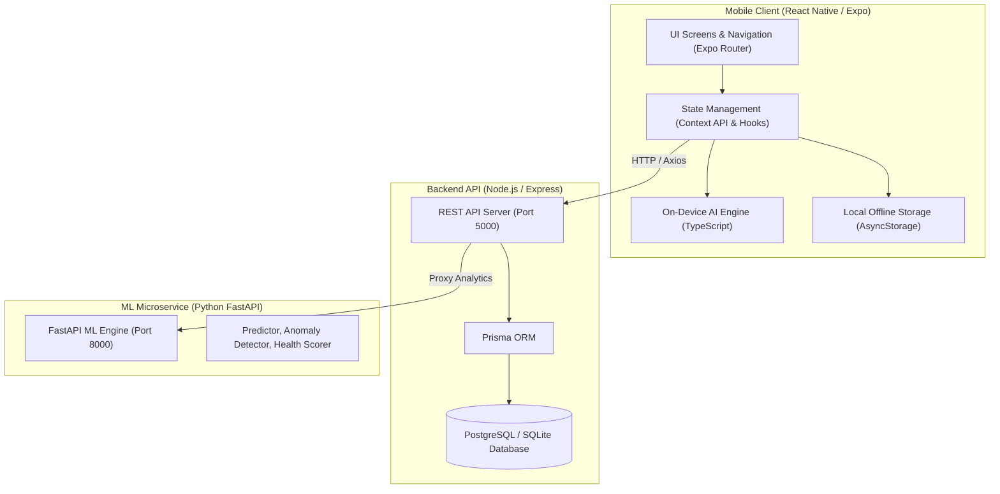

# SpendSense: Project Overview & File-by-File Technical Guide

---

## 1. Executive Summary & System Architecture

**SpendSense** is an intelligent personal finance analytics, budgeting, and predictive financial management system. It provides real-time income and expense tracking, SMS/MoMo alert parsing, camera/receipt OCR, multi-currency support, biometric security, and machine learning models for spending forecasting and anomaly detection.

### High-Level Architecture



---

## 2. Directory Tree Map

```text
finance-analyzer/
├── backend/                  # Node.js Express & Prisma API service
│   ├── prisma/               # Database schema & migrations
│   └── src/                  # Controllers, routes, middleware, utils, config
├── ml-service/               # Python FastAPI machine learning service
│   └── models/               # Regression, anomaly detection, health scoring models
├── mobile/                   # React Native (Expo) mobile frontend
│   ├── app/                  # File-based routing (Expo Router)
│   │   ├── (auth)/           # Authentication screens
│   │   └── (tabs)/           # Core application screens
│   ├── assets/               # Images, brand logos, icons
│   └── src/                  # AI logic, components, contexts, hooks, services, utils
├── screens/                  # Code snapshots of every UI screen
├── docs/                     # Project report & technical documentation
└── PROJECT_OVERVIEW.md       # Master project description (this file)
```

---

## 3. Backend Service (`backend/`)

The backend is built with **Node.js**, **Express.js**, and **Prisma ORM**, providing a secure RESTful API for user authentication, transaction persistence, budget tracking, and analytics integration.

| File Path | Purpose & Responsibility |
|---|---|
| [server.js](file:///c:/Users/USER/Downloads/finance-analyzer/backend/server.js) | Main entry point; initializes environment variables, starts the HTTP server on port 5000, and connects database listeners. |
| [package.json](file:///c:/Users/USER/Downloads/finance-analyzer/backend/package.json) | Node.js project manifest defining backend dependencies (`express`, `@prisma/client`, `jsonwebtoken`, `bcryptjs`, `cors`, `dotenv`, `axios`). |
| [prisma/schema.prisma](file:///c:/Users/USER/Downloads/finance-analyzer/backend/prisma/schema.prisma) | Prisma data schema defining `User`, `Transaction`, `Budget`, `Subscription`, and `Category` database models and relationships. |
| [src/app.js](file:///c:/Users/USER/Downloads/finance-analyzer/backend/src/app.js) | Express app configuration; attaches global middleware (CORS, JSON body parser, request logger) and mounts API routes. |
| [src/config/database.js](file:///c:/Users/USER/Downloads/finance-analyzer/backend/src/config/database.js) | Instantiates and exports the singleton `PrismaClient` database client instance. |
| [src/middleware/auth.js](file:///c:/Users/USER/Downloads/finance-analyzer/backend/src/middleware/auth.js) | JWT authentication middleware; validates `Bearer` tokens in headers and injects authenticated `req.user`. |
| [src/controllers/authController.js](file:///c:/Users/USER/Downloads/finance-analyzer/backend/src/controllers/authController.js) | Handles user signup, login authentication, password hashing with bcrypt, and JWT token issuance. |
| [src/controllers/transactionController.js](file:///c:/Users/USER/Downloads/finance-analyzer/backend/src/controllers/transactionController.js) | CRUD operations for transactions (create, list, filter by category/date, update, and delete). |
| [src/controllers/budgetController.js](file:///c:/Users/USER/Downloads/finance-analyzer/backend/src/controllers/budgetController.js) | Manages monthly budget thresholds per category and compares actual spending against limits. |
| [src/controllers/analyticsController.js](file:///c:/Users/USER/Downloads/finance-analyzer/backend/src/controllers/analyticsController.js) | Aggregates income, expenses, monthly breakdown, savings rates, and interfaces with the Python ML microservice. |
| [src/controllers/predictionController.js](file:///c:/Users/USER/Downloads/finance-analyzer/backend/src/controllers/predictionController.js) | Forwards transaction logs to the ML service to calculate forward-looking expense forecasts and anomaly scores. |
| [src/routes/authRoutes.js](file:///c:/Users/USER/Downloads/finance-analyzer/backend/src/routes/authRoutes.js) | Express route declarations for `/api/auth/register`, `/api/auth/login`, and `/api/auth/me`. |
| [src/routes/transactionRoutes.js](file:///c:/Users/USER/Downloads/finance-analyzer/backend/src/routes/transactionRoutes.js) | Express route declarations for `/api/transactions` endpoints. |
| [src/routes/budgetRoutes.js](file:///c:/Users/USER/Downloads/finance-analyzer/backend/src/routes/budgetRoutes.js) | Express route declarations for `/api/budgets` endpoints. |
| [src/routes/analyticsRoutes.js](file:///c:/Users/USER/Downloads/finance-analyzer/backend/src/routes/analyticsRoutes.js) | Express route declarations for `/api/analytics` summary statistics. |
| [src/routes/predictionRoutes.js](file:///c:/Users/USER/Downloads/finance-analyzer/backend/src/routes/predictionRoutes.js) | Express route declarations for `/api/predictions` forward predictions. |
| [src/utils/seedData.js](file:///c:/Users/USER/Downloads/finance-analyzer/backend/src/utils/seedData.js) | Database seeder script populated with realistic historical transactions across categories for testing. |
| [src/utils/ensureDemoUser.js](file:///c:/Users/USER/Downloads/finance-analyzer/backend/src/utils/ensureDemoUser.js) | Utility that automatically ensures default demo credentials exist on backend initialization. |

---

## 4. Machine Learning Service (`ml-service/`)

The ML microservice is built using **Python** and **FastAPI**. It delivers mathematical and statistical intelligence, time-series forecasting, anomaly detection, and automated financial scoring.

| File Path | Purpose & Responsibility |
|---|---|
| [main.py](file:///c:/Users/USER/Downloads/finance-analyzer/ml-service/main.py) | FastAPI application exposing REST endpoints: `/predict/expenses`, `/analyze/anomalies`, `/analyze/health-score`, and `/recommend`. |
| [requirements.txt](file:///c:/Users/USER/Downloads/finance-analyzer/ml-service/requirements.txt) | Python dependencies (`fastapi`, `uvicorn`, `pydantic`, `numpy`, `scikit-learn`, `pandas`). |
| [models/expense_predictor.py](file:///c:/Users/USER/Downloads/finance-analyzer/ml-service/models/expense_predictor.py) | Time-series and regression model predicting next month's total spending based on historical velocity and trends. |
| [models/anomaly_detector.py](file:///c:/Users/USER/Downloads/finance-analyzer/ml-service/models/anomaly_detector.py) | Identifies outlier transactions and statistical spending surges using standard deviation thresholding (Z-score). |
| [models/health_scorer.py](file:///c:/Users/USER/Downloads/finance-analyzer/ml-service/models/health_scorer.py) | Computes a financial health rating (0–100) evaluating savings rate, expense-to-income ratio, and consistency. |
| [models/recommender.py](file:///c:/Users/USER/Downloads/finance-analyzer/ml-service/models/recommender.py) | Rule-based and statistical engine producing tailored, domain-specific money-saving suggestions. |

---

## 5. Mobile Application (`mobile/`)

The mobile client is developed using **React Native**, **Expo**, **Expo Router**, and **TypeScript**. It operates fully offline with on-device heuristics and syncs with the backend when available.

### 5.1 Project Root & Configuration
| File Path | Purpose & Responsibility |
|---|---|
| [App.tsx](file:///c:/Users/USER/Downloads/finance-analyzer/mobile/App.tsx) | Root application wrapper component connecting theme and security contexts. |
| [index.ts](file:///c:/Users/USER/Downloads/finance-analyzer/mobile/index.ts) | Expo Router entry point triggering `expo-router/entry`. |
| [app.json](file:///c:/Users/USER/Downloads/finance-analyzer/mobile/app.json) | Expo project configuration (app name, icon, splash screen, camera permissions, scheme). |
| [package.json](file:///c:/Users/USER/Downloads/finance-analyzer/mobile/package.json) | React Native dependencies (`expo`, `expo-router`, `expo-camera`, `expo-local-authentication`, `react-native-chart-kit`, `@react-native-async-storage/async-storage`). |
| [tsconfig.json](file:///c:/Users/USER/Downloads/finance-analyzer/mobile/tsconfig.json) | TypeScript compiler options and alias path mappings. |
| [babel.config.js](file:///c:/Users/USER/Downloads/finance-analyzer/mobile/babel.config.js) | Babel presets including Expo configuration. |
| [eas.json](file:///c:/Users/USER/Downloads/finance-analyzer/mobile/eas.json) | Expo Application Services (EAS) build and deployment profiles. |
| [SPENDSENSE_UI_DESIGN_SPEC.md](file:///c:/Users/USER/Downloads/finance-analyzer/mobile/SPENDSENSE_UI_DESIGN_SPEC.md) | Comprehensive UI/UX design specifications, color palettes, typographic scales, and layout guidelines. |

---

### 5.2 Navigation & App Routes (`mobile/app/`)
| File Path | Purpose & Responsibility |
|---|---|
| [app/_layout.tsx](file:///c:/Users/USER/Downloads/finance-analyzer/mobile/app/_layout.tsx) | Root application layout wrapping all child screens in Theme, Auth, Finance, Settings, and Subscription providers. |
| [app/index.tsx](file:///c:/Users/USER/Downloads/finance-analyzer/mobile/app/index.tsx) | Landing gatekeeper route determining if user routes to `/lock`, `/(tabs)`, or `/(auth)/login`. |
| [app/lock.tsx](file:///c:/Users/USER/Downloads/finance-analyzer/mobile/app/lock.tsx) | Biometric security lock screen supporting Face ID, Fingerprint, Iris, and PIN fallback. |
| [app/splash.tsx](file:///c:/Users/USER/Downloads/finance-analyzer/mobile/app/splash.tsx) | Initial splash/launch loading screen. |
| [app/(auth)/_layout.tsx](file:///c:/Users/USER/Downloads/finance-analyzer/mobile/app/%28auth%29/_layout.tsx) | Stack navigation configuration for authentication routes. |
| [app/(auth)/login.tsx](file:///c:/Users/USER/Downloads/finance-analyzer/mobile/app/%28auth%29/login.tsx) | User login screen with email, password validation, and auth error handling. |
| [app/(auth)/register.tsx](file:///c:/Users/USER/Downloads/finance-analyzer/mobile/app/%28auth%29/register.tsx) | User registration screen with password confirmation and auto-login. |
| [app/(tabs)/_layout.tsx](file:///c:/Users/USER/Downloads/finance-analyzer/mobile/app/%28tabs%29/_layout.tsx) | Bottom tab navigation bar with icons and theme-responsive styling. |
| [app/(tabs)/index.tsx](file:///c:/Users/USER/Downloads/finance-analyzer/mobile/app/%28tabs%29/index.tsx) | Dashboard/Home screen displaying balance hero card, health score gauge, AI insights, and recent transactions. |
| [app/(tabs)/dashboard.tsx](file:///c:/Users/USER/Downloads/finance-analyzer/mobile/app/%28tabs%29/dashboard.tsx) | Alias routing component pointing to the primary Dashboard. |
| [app/(tabs)/transactions.tsx](file:///c:/Users/USER/Downloads/finance-analyzer/mobile/app/%28tabs%29/transactions.tsx) | Full transaction history with filter chips, anomaly alerts, search, and long-press deletion. |
| [app/(tabs)/add-transaction.tsx](file:///c:/Users/USER/Downloads/finance-analyzer/mobile/app/%28tabs%29/add-transaction.tsx) | Screen to record income/expense with amount, title, category grid, and notes. |
| [app/(tabs)/edit-transaction.tsx](file:///c:/Users/USER/Downloads/finance-analyzer/mobile/app/%28tabs%29/edit-transaction.tsx) | Screen to edit an existing transaction's amount, category, or title. |
| [app/(tabs)/budget.tsx](file:///c:/Users/USER/Downloads/finance-analyzer/mobile/app/%28tabs%29/budget.tsx) | Budget tracker displaying monthly thresholds, category progress bars, and overspending advice. |
| [app/(tabs)/subscriptions.tsx](file:///c:/Users/USER/Downloads/finance-analyzer/mobile/app/%28tabs%29/subscriptions.tsx) | Recurring subscription tracker with due-soon alerts, cost normalizer, and quick-add templates. |
| [app/(tabs)/analytics.tsx](file:///c:/Users/USER/Downloads/finance-analyzer/mobile/app/%28tabs%29/analytics.tsx) | Analytics screen with spending trend line charts, savings rate progress, and quarterly scenarios. |
| [app/(tabs)/predictions.tsx](file:///c:/Users/USER/Downloads/finance-analyzer/mobile/app/%28tabs%29/predictions.tsx) | AI predictions screen showing expected spending, confidence rating, anomaly flags, and tips. |
| [app/(tabs)/forecast.tsx](file:///c:/Users/USER/Downloads/finance-analyzer/mobile/app/%28tabs%29/forecast.tsx) | 4-month ML forward expense forecast with multi-scenario projections. |
| [app/(tabs)/insights.tsx](file:///c:/Users/USER/Downloads/finance-analyzer/mobile/app/%28tabs%29/insights.tsx) | AI insights screen diagnosing top spending categories and recommending optimizations. |
| [app/(tabs)/receipt-scanner.tsx](file:///c:/Users/USER/Downloads/finance-analyzer/mobile/app/%28tabs%29/receipt-scanner.tsx) | OCR receipt scanner utilizing device camera and photo library to extract amounts and merchants. |
| [app/(tabs)/sms-import.tsx](file:///c:/Users/USER/Downloads/finance-analyzer/mobile/app/%28tabs%29/sms-import.tsx) | Financial SMS and Mobile Money parser for extracting transaction details from copied alert messages. |
| [app/(tabs)/reports.tsx](file:///c:/Users/USER/Downloads/finance-analyzer/mobile/app/%28tabs%29/reports.tsx) | Periodic financial reports generator with CSV export and cross-platform sharing. |
| [app/(tabs)/profile.tsx](file:///c:/Users/USER/Downloads/finance-analyzer/mobile/app/%28tabs%29/profile.tsx) | User profile screen featuring stats overview, quick links, and sign-out dialog. |
| [app/(tabs)/settings.tsx](file:///c:/Users/USER/Downloads/finance-analyzer/mobile/app/%28tabs%29/settings.tsx) | App settings including Dark/Light mode, multi-currency modal, biometric switch, and notifications. |

---

### 5.3 On-Device AI & Intelligence (`mobile/src/ai/`)
| File Path | Purpose & Responsibility |
|---|---|
| [prediction.ts](file:///c:/Users/USER/Downloads/finance-analyzer/mobile/src/ai/prediction.ts) | Local regression algorithm calculating next month's predicted expense and trend trajectory. |
| [anomalyDetection.ts](file:///c:/Users/USER/Downloads/finance-analyzer/mobile/src/ai/anomalyDetection.ts) | On-device anomaly detection flagging single transactions that exceed category averages. |
| [healthScore.ts](file:///c:/Users/USER/Downloads/finance-analyzer/mobile/src/ai/healthScore.ts) | Calculates 0–100 financial health score based on savings rate, cashflow, and expenditure volatility. |
| [insights.ts](file:///c:/Users/USER/Downloads/finance-analyzer/mobile/src/ai/insights.ts) | Produces contextual insights and practical money-saving advice for each spending category. |
| [categoryAnalysis.ts](file:///c:/Users/USER/Downloads/finance-analyzer/mobile/src/ai/categoryAnalysis.ts) | Computes category totals, percentages of total spending, and highest expense categories. |
| [trendAnalysis.ts](file:///c:/Users/USER/Downloads/finance-analyzer/mobile/src/ai/trendAnalysis.ts) | Formats historical monthly trends into month-by-month time series for chart renderers. |
| [savingsAnalysis.ts](file:///c:/Users/USER/Downloads/finance-analyzer/mobile/src/ai/savingsAnalysis.ts) | Evaluates user savings velocity against income. |
| [financialAlerts.ts](file:///c:/Users/USER/Downloads/finance-analyzer/mobile/src/ai/financialAlerts.ts) | Triggers automated alerts when budget thresholds (80%, 100%) are breached. |
| [reportGenerator.ts](file:///c:/Users/USER/Downloads/finance-analyzer/mobile/src/ai/reportGenerator.ts) | Synthesizes periodic summary reports and formatted CSV strings for export. |

---

### 5.4 Reusable UI Components (`mobile/src/components/`)
| File Path | Purpose & Responsibility |
|---|---|
| [button/index.tsx](file:///c:/Users/USER/Downloads/finance-analyzer/mobile/src/components/button/index.tsx) | Reusable `PrimaryButton`, `SecondaryButton`, and `OutlineButton` components. |
| [input/index.tsx](file:///c:/Users/USER/Downloads/finance-analyzer/mobile/src/components/input/index.tsx) | Standardized form text input with label, placeholder, and theme integration. |
| [logo/index.tsx](file:///c:/Users/USER/Downloads/finance-analyzer/mobile/src/components/logo/index.tsx) | SpendSense branding logo component. |
| [stat-card/index.tsx](file:///c:/Users/USER/Downloads/finance-analyzer/mobile/src/components/stat-card/index.tsx) | Metric tile displaying numeric values, trend subtext, and custom color accents. |
| [transaction-tile/index.tsx](file:///c:/Users/USER/Downloads/finance-analyzer/mobile/src/components/transaction-tile/index.tsx) | Formatted list item representing a transaction with icon, title, category, date, and amount. |

---

### 5.5 State Management & Contexts (`mobile/src/context/`)
| File Path | Purpose & Responsibility |
|---|---|
| [AuthContext.tsx](file:///c:/Users/USER/Downloads/finance-analyzer/mobile/src/context/AuthContext.tsx) | Global authentication state (current user, tokens, login, signup, logout actions). |
| [FinanceContext.tsx](file:///c:/Users/USER/Downloads/finance-analyzer/mobile/src/context/FinanceContext.tsx) | Central financial state (transactions array, income, expenses, balance, add/delete/update). |
| [ThemeContext.tsx](file:///c:/Users/USER/Downloads/finance-analyzer/mobile/src/context/ThemeContext.tsx) | Dark and Light theme provider managing active color schemes and styling tokens. |
| [SettingsContext.tsx](file:///c:/Users/USER/Downloads/finance-analyzer/mobile/src/context/SettingsContext.tsx) | User preferences (active currency, biometric lock toggle, notification status). |
| [SubscriptionContext.tsx](file:///c:/Users/USER/Downloads/finance-analyzer/mobile/src/context/SubscriptionContext.tsx) | Recurring subscription state, monthly/yearly calculations, and renewal date trackers. |

---

### 5.6 Custom Hooks (`mobile/src/hooks/`)
| File Path | Purpose & Responsibility |
|---|---|
| [useAuth.ts](file:///c:/Users/USER/Downloads/finance-analyzer/mobile/src/hooks/useAuth.ts) | Hook exposing authentication status, user details, and auth operations. |
| [useFinance.ts](file:///c:/Users/USER/Downloads/finance-analyzer/mobile/src/hooks/useFinance.ts) | Hook providing direct access to financial data, balances, and transaction actions. |
| [useTheme.ts](file:///c:/Users/USER/Downloads/finance-analyzer/mobile/src/hooks/useTheme.ts) | Hook returning the active theme palette and dark mode toggle. |
| [useSettings.ts](file:///c:/Users/USER/Downloads/finance-analyzer/mobile/src/hooks/useSettings.ts) | Hook providing user settings, currency formatting (`formatMoney`), and preferences. |
| [useSubscriptions.ts](file:///c:/Users/USER/Downloads/finance-analyzer/mobile/src/hooks/useSubscriptions.ts) | Hook managing subscriptions, monthly aggregates, and impending renewals. |
| [useBiometric.ts](file:///c:/Users/USER/Downloads/finance-analyzer/mobile/src/hooks/useBiometric.ts) | Native biometric hook querying hardware capabilities and executing authentication prompts. |

---

### 5.7 Types, Utilities, Constants & Theme
| File Path | Purpose & Responsibility |
|---|---|
| [types/finance.ts](file:///c:/Users/USER/Downloads/finance-analyzer/mobile/src/types/finance.ts) | TypeScript interfaces for `Transaction`, `Category`, `Budget`, and predefined category lists. |
| [types/subscription.ts](file:///c:/Users/USER/Downloads/finance-analyzer/mobile/src/types/subscription.ts) | TypeScript interfaces for `Subscription`, billing cycle helpers, and templates. |
| [types/async-storage.d.ts](file:///c:/Users/USER/Downloads/finance-analyzer/mobile/src/types/async-storage.d.ts) | Type definitions for offline local storage. |
| [constants/colors.ts](file:///c:/Users/USER/Downloads/finance-analyzer/mobile/src/constants/colors.ts) | Theme palettes, semantic accents, and hero gradients for Dark and Light modes. |
| [theme/colors.ts](file:///c:/Users/USER/Downloads/finance-analyzer/mobile/src/theme/colors.ts) | Color token definitions. |
| [services/api.ts](file:///c:/Users/USER/Downloads/finance-analyzer/mobile/src/services/api.ts) | Axios HTTP client configured for backend and ML-service communication. |
| [sms/smsParser.ts](file:///c:/Users/USER/Downloads/finance-analyzer/mobile/src/sms/smsParser.ts) | Regex parser extracting amounts, merchants, reference numbers, and types from bank and Mobile Money SMS alerts. |
| [utils/receiptParser.ts](file:///c:/Users/USER/Downloads/finance-analyzer/mobile/src/utils/receiptParser.ts) | Helper utilities for extracting merchant and total price data from scanned receipts. |
| [utils/notifications.ts](file:///c:/Users/USER/Downloads/finance-analyzer/mobile/src/utils/notifications.ts) | Push notification helpers for budget warnings and reminder triggers. |
| [utils/requestNotificationPermission.ts](file:///c:/Users/USER/Downloads/finance-analyzer/mobile/src/utils/requestNotificationPermission.ts) | Operating system permission request handler for notifications. |

---

## 6. Design Artifacts & Documentation Directories

| Directory / File Path | Purpose & Responsibility |
|---|---|
| [screens/](file:///c:/Users/USER/Downloads/finance-analyzer/screens/) | Contains exact code snapshots (`01-splash.md` through `19-settings.md`) of all application screens. |
| [screens/README.md](file:///c:/Users/USER/Downloads/finance-analyzer/screens/README.md) | Table of contents linking each screen snapshot to its live codebase file. |
| [docs/SPENDSENSE_PROJECT_REPORT.md](file:///c:/Users/USER/Downloads/finance-analyzer/docs/SPENDSENSE_PROJECT_REPORT.md) | Comprehensive academic and architectural project report covering system methodology, implementation, algorithms, and results. |
